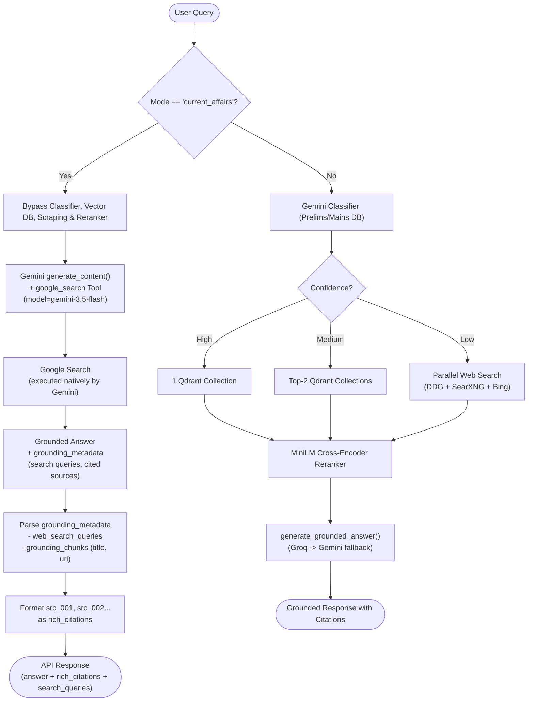
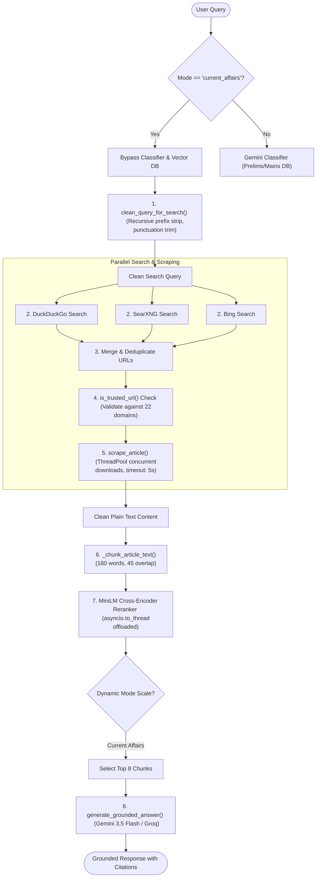

```mermaid
graph TD
    UserQuery(["User Query"]) --> Router{"Mode == 'current_affairs'?"}

    %% Router decision
    Router -- Yes --> DirectGrounding["Bypass Classifier, Vector DB, Scraping & Reranker"]
    Router -- No  --> Classifier["Gemini Classifier (Prelims/Mains DB)"]

    %% Gemini Grounding Path
    DirectGrounding --> GeminiGrounding["Gemini generate_content()\n+ google_search Tool\n(model=gemini-3.5-flash)"]
    GeminiGrounding --> GoogleSearch["Google Search\n(executed natively by Gemini)"]
    GoogleSearch --> GroundedResponse["Grounded Answer\n+ grounding_metadata\n(search queries, cited sources)"]

    %% Parse metadata
    GroundedResponse --> ParseMeta["Parse grounding_metadata\n- web_search_queries\n- grounding_chunks (title, uri)"]
    ParseMeta --> FormatCitations["Format src_001, src_002...\nas rich_citations"]
    FormatCitations --> APIResponse(["API Response\n(answer + rich_citations + search_queries)"])

    %% Standard RAG path (Prelims/Mains)
    Classifier --> ConfidenceRoute{"Confidence?"}
    ConfidenceRoute -- High --> VectorDB1["1 Qdrant Collection"]
    ConfidenceRoute -- Medium --> VectorDB2["Top-2 Qdrant Collections"]
    ConfidenceRoute -- Low --> WebSearch["Parallel Web Search\n(DDG + SearXNG + Bing)"]
    VectorDB1 --> Reranker["MiniLM Cross-Encoder Reranker"]
    VectorDB2 --> Reranker
    WebSearch --> Reranker
    Reranker --> LLM["generate_grounded_answer()\n(Groq -> Gemini fallback)"]
    LLM --> StandardResponse(["Grounded Response with Citations"])
```

# Current Affairs Extraction & RAG Pipeline Workflow

This document outlines the step-by-step technical architecture and sequence flow of the Current Affairs retrieval-augmented generation (RAG) pipeline, including the recent optimizations for concurrency, quality, and latency.

---

## Architectural Flow Diagram


---

## Detailed Step-by-Step Execution Workflow

### Stage 1: Route & Bypass
* **Trigger:** The client sends a request to `/api/v1/query/stream` or `/api/v1/query` with `mode: "current_affairs"`.
* **Action:** The system bypasses Qdrant vector database search (since static textbook PDFs do not contain recent events) and routes directly to the parallel web search pipeline.

### Stage 2: Search Query Optimization (Query Cleaning)
* **Function:** `clean_query_for_search()` in [search_pipeline.py](file:///c:/Users/vishn/Downloads/RAG-main/RAG-main/app/retrieval/search_pipeline.py#L342-L387).
* **Process:**
  1. Strip conversational fillers and prefix structures (e.g., `What is the current status of`, `Discuss the updates on`, etc.) recursively.
  2. Normalize possessives (`isro's` $\rightarrow$ `isro`).
  3. Trim trailing punctuation (`?`, `.`, `!`).
  4. Returns clean, high-density keywords optimized for commercial search index parsers.

### Stage 3: Concurrent Search Execution
* **Function:** `parallel_search()` in [search_pipeline.py](file:///c:/Users/vishn/Downloads/RAG-main/RAG-main/app/retrieval/search_pipeline.py#L409-L523).
* **Process:** Launches 3 search providers concurrently inside a `ThreadPoolExecutor`:
  * **DuckDuckGo:** Scrapes search listings via its mobile fallback.
  * **SearXNG:** Queries public instances (if healthy).
  * **Bing:** Scrapes main search listing page.

### Stage 4: URL Filtering & Trust Validation
* **Function:** `is_trusted_url()` in [search_pipeline.py](file:///c:/Users/vishn/Downloads/RAG-main/RAG-main/app/retrieval/search_pipeline.py#L318-L339).
* **Filter:** Extracted URLs must match the `TRUSTED_SITES` registry list.
* **Coverage:** Includes 22 trusted UPSC coaching and official news domains:
  * **Government:** `pib.gov.in`, `prsindia.org`, `gov.in`, `nic.in`.
  * **Mainstream News:** `thehindu.com`, `indianexpress.com`, `livemint.com`, `businessstandard.com`, `ndtv.com`, `timesofindia.indiatimes.com`.
  * **UPSC Reference Blogs:** `insightsias.com`, `civilsdaily.com`, `iasbaba.com`, `drishtiias.com`, `wikipedia.org`.

### Stage 5: Concurrent Scrape & Parsing
* **Function:** `scrape_article()` in [search_pipeline.py](file:///c:/Users/vishn/Downloads/RAG-main/RAG-main/app/retrieval/search_pipeline.py#L258-L311).
* **Action:** Downloads article HTML concurrently.
  * **Boilerplate Removal:** Decomposes code tags (`script`, `style`, `nav`, `footer`, `header`, `aside`) using BeautifulSoup.
  * **Text Extraction:** Joins all paragraph `<p>` tags with character counts $> 40$.
  * **Timeout Limit:** Reduced from 10s $\rightarrow$ 5s to avoid slow hanging sites bottlenecking the pipeline.
  * **Persistence:** Cache hits are resolved instantly via a local SQLite cache.

### Stage 6: Overlapping Text Chunking
* **Function:** `_chunk_article_text()` in [search_pipeline.py](file:///c:/Users/vishn/Downloads/RAG-main/RAG-main/app/retrieval/search_pipeline.py#L390-L404).
* **Parameters:** Chunk size = `180 words` ($\approx 240$ tokens), Overlap = `45 words`.
* **Purpose:** Fits model context windows and preserves transitional sentences across boundaries.

### Stage 7: Concurrency-Safe Reranking
* **Function:** `rerank()` in [reranker.py](file:///c:/Users/vishn/Downloads/RAG-main/RAG-main/app/retrieval/reranker.py#L37-L91).
* **Safety:** Offloaded via `asyncio.to_thread` to prevent PyTorch computation from locking the FastAPI event loop.
* **Process:** Ranks chunks based on semantic alignment to query.
* **Dynamic Scaling:** For Current Affairs, the top **8 chunks** are selected for LLM consumption.

### Stage 8: Grounded LLM Generation
* **Function:** `generate_grounded_answer()` in [generator.py](file:///c:/Users/vishn/Downloads/RAG-main/RAG-main/app/retrieval/generator.py#L24).
* **Safeguards:**
  * **Score Gate:** If the highest reranker score is $< 0.0$, LLM call is aborted (returns "insufficient info").
  * **Strict Prompt:** Imposes a strict context-only prompt that explicitly forbids using external knowledge.
  * **Inline Citations:** Matches claims back to their exact parent chunks (`[chk_001]`).


---

## Architectural Flow Diagram



---

## Detailed Step-by-Step Execution Workflow

### Stage 1: Route & Bypass

* **Trigger:** The client sends a request to `/api/v1/query` with `mode: "current_affairs"`.
* **Action:** The system bypasses ALL of the following:
  * Qdrant vector database search (static textbook PDFs cannot contain recent events)
  * DuckDuckGo / SearXNG / Bing web scraping pipeline
  * BeautifulSoup article parsing & SQLite caching
  * MiniLM cross-encoder reranking
* **Returns:** `routing = "current_affairs_grounding"`, `chunks = []`, `candidates = []`

---

### Stage 2: Gemini Google Search Grounding

* **Function:** `_call_gemini_grounded()` in [generator.py](file:///c:/Users/vishn/Downloads/RAG-main/RAG-main/app/retrieval/generator.py)
* **SDK:** `google-genai` (new SDK, `google.genai.Client`)
* **API call:**
  ```python
  client.models.generate_content(
      model="gemini-3.5-flash",
      contents=query,
      config=GenerateContentConfig(
          system_instruction="<UPSC-CURRENT persona>",
          tools=[Tool(google_search=GoogleSearch())],
          temperature=0.0,
      ),
  )
  ```
* **Key Rotation:** Iterates across all comma-separated keys in `GEMINI_API_KEY` until one succeeds (handles per-key 429 rate limits).
* **System Instruction:** A concise UPSC-focused persona guiding Gemini to structure answers with headers:
  * `**What Happened / Recent Development**`
  * `**Background & Context**`
  * `**Government Response / Policy Measures**`
  * `**Key Implications (Prelims/Mains)**`
  * `**UPSC Keywords to Remember**`

---

### Stage 3: Grounding Metadata Parsing

* **Source:** `response.candidates[0].grounding_metadata`
* **Fields extracted:**
  * `web_search_queries` — list of Google Search queries Gemini auto-executed
  * `grounding_chunks[].web.title` — source article title
  * `grounding_chunks[].web.uri` — source article URL
* **Output:** Rich citations list `[{chunk_id: "src_001", document: "Title", url: "..."}]`

---

### Stage 4: API Response

The final response is compatible with the existing `QueryResponse` schema:

| Field | Content |
|---|---|
| `answer` | Structured markdown (grounded in live Google Search results) |
| `answered` | `true` if Gemini returned a non-empty answer |
| `citations` | `["src_001", "src_002", ...]` — source labels |
| `rich_citations` | `[{chunk_id, document, url, pages, preview}]` |
| `routing` | `"current_affairs_grounding"` |
| `search_queries` | The Google Search queries Gemini executed |
| `log_info` | Human-readable description with queries used |

---

## Billing Requirement

> **Google Search Grounding requires a paid/billing-enabled Gemini API key.**
> Free-tier keys return `429 RESOURCE_EXHAUSTED` for search grounding even when plain
> text generation succeeds. Ensure your `GEMINI_API_KEY` keys are linked to a
> Google Cloud billing account.

---

## Comparison: Old vs New Architecture

| Aspect | Old (Web Scraping) | New (Gemini Grounding) |
|---|---|---|
| **Search Providers** | DDG + SearXNG + Bing | Google Search (native) |
| **Scraping** | BeautifulSoup + requests | None (Gemini handles it) |
| **Reranking** | MiniLM Cross-Encoder | None needed |
| **Latency** | ~8-12 seconds | ~2-4 seconds |
| **Result Quality** | Depends on trusted sites whitelist | Google Search (highest quality) |
| **Citation Type** | `[chk_001]` chunk IDs | `[src_001]` web source URLs |
| **Billing** | Free (no API key for search) | Paid Gemini API key required |
| **Freshness** | Subject to scraping failures | Real-time via Google |


---

## Architectural Flow Diagram



---

## Detailed Step-by-Step Execution Workflow

### Stage 1: Route & Bypass
* **Trigger:** The client sends a request to `/api/v1/query/stream` or `/api/v1/query` with `mode: "current_affairs"`.
* **Action:** The system bypasses Qdrant vector database search (since static textbook PDFs do not contain recent events) and routes directly to the parallel web search pipeline.

### Stage 2: Search Query Optimization (Query Cleaning)
* **Function:** `clean_query_for_search()` in [search_pipeline.py](file:///c:/Users/vishn/Downloads/RAG-main/RAG-main/app/retrieval/search_pipeline.py#L342-L387).
* **Process:**
  1. Strip conversational fillers and prefix structures (e.g., `What is the current status of`, `Discuss the updates on`, etc.) recursively.
  2. Normalize possessives (`isro's` $\rightarrow$ `isro`).
  3. Trim trailing punctuation (`?`, `.`, `!`).
  4. Returns clean, high-density keywords optimized for commercial search index parsers.

### Stage 3: Concurrent Search Execution
* **Function:** `parallel_search()` in [search_pipeline.py](file:///c:/Users/vishn/Downloads/RAG-main/RAG-main/app/retrieval/search_pipeline.py#L409-L523).
* **Process:** Launches 3 search providers concurrently inside a `ThreadPoolExecutor`:
  * **DuckDuckGo:** Scrapes search listings via its mobile fallback.
  * **SearXNG:** Queries public instances (if healthy).
  * **Bing:** Scrapes main search listing page.

### Stage 4: URL Filtering & Trust Validation
* **Function:** `is_trusted_url()` in [search_pipeline.py](file:///c:/Users/vishn/Downloads/RAG-main/RAG-main/app/retrieval/search_pipeline.py#L318-L339).
* **Filter:** Extracted URLs must match the `TRUSTED_SITES` registry list.
* **Coverage:** Includes 22 trusted UPSC coaching and official news domains:
  * **Government:** `pib.gov.in`, `prsindia.org`, `gov.in`, `nic.in`.
  * **Mainstream News:** `thehindu.com`, `indianexpress.com`, `livemint.com`, `businessstandard.com`, `ndtv.com`, `timesofindia.indiatimes.com`.
  * **UPSC Reference Blogs:** `insightsias.com`, `civilsdaily.com`, `iasbaba.com`, `drishtiias.com`, `wikipedia.org`.

### Stage 5: Concurrent Scrape & Parsing
* **Function:** `scrape_article()` in [search_pipeline.py](file:///c:/Users/vishn/Downloads/RAG-main/RAG-main/app/retrieval/search_pipeline.py#L258-L311).
* **Action:** Downloads article HTML concurrently.
  * **Boilerplate Removal:** Decomposes code tags (`script`, `style`, `nav`, `footer`, `header`, `aside`) using BeautifulSoup.
  * **Text Extraction:** Joins all paragraph `<p>` tags with character counts $> 40$.
  * **Timeout Limit:** Reduced from 10s $\rightarrow$ 5s to avoid slow hanging sites bottlenecking the pipeline.
  * **Persistence:** Cache hits are resolved instantly via a local SQLite cache.

### Stage 6: Overlapping Text Chunking
* **Function:** `_chunk_article_text()` in [search_pipeline.py](file:///c:/Users/vishn/Downloads/RAG-main/RAG-main/app/retrieval/search_pipeline.py#L390-L404).
* **Parameters:** Chunk size = `180 words` ($\approx 240$ tokens), Overlap = `45 words`.
* **Purpose:** Fits model context windows and preserves transitional sentences across boundaries.

### Stage 7: Concurrency-Safe Reranking
* **Function:** `rerank()` in [reranker.py](file:///c:/Users/vishn/Downloads/RAG-main/RAG-main/app/retrieval/reranker.py#L37-L91).
* **Safety:** Offloaded via `asyncio.to_thread` to prevent PyTorch computation from locking the FastAPI event loop.
* **Process:** Ranks chunks based on semantic alignment to query.
* **Dynamic Scaling:** For Current Affairs, the top **8 chunks** are selected for LLM consumption.

### Stage 8: Grounded LLM Generation
* **Function:** `generate_grounded_answer()` in [generator.py](file:///c:/Users/vishn/Downloads/RAG-main/RAG-main/app/retrieval/generator.py#L24).
* **Safeguards:**
  * **Score Gate:** If the highest reranker score is $< 0.0$, LLM call is aborted (returns "insufficient info").
  * **Strict Prompt:** Imposes a strict context-only prompt that explicitly forbids using external knowledge.
  * **Inline Citations:** Matches claims back to their exact parent chunks (`[chk_001]`).


---

## Architectural Flow Diagram



---

## Detailed Step-by-Step Execution Workflow

### Stage 1: Route & Bypass

* **Trigger:** The client sends a request to `/api/v1/query` with `mode: "current_affairs"`.
* **Action:** The system bypasses ALL of the following:
  * Qdrant vector database search (static textbook PDFs cannot contain recent events)
  * DuckDuckGo / SearXNG / Bing web scraping pipeline
  * BeautifulSoup article parsing & SQLite caching
  * MiniLM cross-encoder reranking
* **Returns:** `routing = "current_affairs_grounding"`, `chunks = []`, `candidates = []`

---

### Stage 2: Gemini Google Search Grounding

* **Function:** `_call_gemini_grounded()` in [generator.py](file:///c:/Users/vishn/Downloads/RAG-main/RAG-main/app/retrieval/generator.py)
* **SDK:** `google-genai` (new SDK, `google.genai.Client`)
* **API call:**
  ```python
  client.models.generate_content(
      model="gemini-3.5-flash",
      contents=query,
      config=GenerateContentConfig(
          system_instruction="<UPSC-CURRENT persona>",
          tools=[Tool(google_search=GoogleSearch())],
          temperature=0.0,
      ),
  )
  ```
* **Key Rotation:** Iterates across all comma-separated keys in `GEMINI_API_KEY` until one succeeds (handles per-key 429 rate limits).
* **System Instruction:** A concise UPSC-focused persona guiding Gemini to structure answers with headers:
  * `**What Happened / Recent Development**`
  * `**Background & Context**`
  * `**Government Response / Policy Measures**`
  * `**Key Implications (Prelims/Mains)**`
  * `**UPSC Keywords to Remember**`

---

### Stage 3: Grounding Metadata Parsing

* **Source:** `response.candidates[0].grounding_metadata`
* **Fields extracted:**
  * `web_search_queries` — list of Google Search queries Gemini auto-executed
  * `grounding_chunks[].web.title` — source article title
  * `grounding_chunks[].web.uri` — source article URL
* **Output:** Rich citations list `[{chunk_id: "src_001", document: "Title", url: "..."}]`

---

### Stage 4: API Response

The final response is compatible with the existing `QueryResponse` schema:

| Field | Content |
|---|---|
| `answer` | Structured markdown (grounded in live Google Search results) |
| `answered` | `true` if Gemini returned a non-empty answer |
| `citations` | `["src_001", "src_002", ...]` — source labels |
| `rich_citations` | `[{chunk_id, document, url, pages, preview}]` |
| `routing` | `"current_affairs_grounding"` |
| `search_queries` | The Google Search queries Gemini executed |
| `log_info` | Human-readable description with queries used |

---

## Billing Requirement

> **Google Search Grounding requires a paid/billing-enabled Gemini API key.**
> Free-tier keys return `429 RESOURCE_EXHAUSTED` for search grounding even when plain
> text generation succeeds. Ensure your `GEMINI_API_KEY` keys are linked to a
> Google Cloud billing account.

---

## Comparison: Old vs New Architecture

| Aspect | Old (Web Scraping) | New (Gemini Grounding) |
|---|---|---|
| **Search Providers** | DDG + SearXNG + Bing | Google Search (native) |
| **Scraping** | BeautifulSoup + requests | None (Gemini handles it) |
| **Reranking** | MiniLM Cross-Encoder | None needed |
| **Latency** | ~8-12 seconds | ~2-4 seconds |
| **Result Quality** | Depends on trusted sites whitelist | Google Search (highest quality) |
| **Citation Type** | `[chk_001]` chunk IDs | `[src_001]` web source URLs |
| **Billing** | Free (no API key for search) | Paid Gemini API key required |
| **Freshness** | Subject to scraping failures | Real-time via Google |


---

## Architectural Flow Diagram


---

## Detailed Step-by-Step Execution Workflow

### Stage 1: Route & Bypass
* **Trigger:** The client sends a request to `/api/v1/query/stream` or `/api/v1/query` with `mode: "current_affairs"`.
* **Action:** The system bypasses Qdrant vector database search (since static textbook PDFs do not contain recent events) and routes directly to the parallel web search pipeline.

### Stage 2: Search Query Optimization (Query Cleaning)
* **Function:** `clean_query_for_search()` in [search_pipeline.py](file:///c:/Users/vishn/Downloads/RAG-main/RAG-main/app/retrieval/search_pipeline.py#L342-L387).
* **Process:**
  1. Strip conversational fillers and prefix structures (e.g., `What is the current status of`, `Discuss the updates on`, etc.) recursively.
  2. Normalize possessives (`isro's` $\rightarrow$ `isro`).
  3. Trim trailing punctuation (`?`, `.`, `!`).
  4. Returns clean, high-density keywords optimized for commercial search index parsers.

### Stage 3: Concurrent Search Execution
* **Function:** `parallel_search()` in [search_pipeline.py](file:///c:/Users/vishn/Downloads/RAG-main/RAG-main/app/retrieval/search_pipeline.py#L409-L523).
* **Process:** Launches 3 search providers concurrently inside a `ThreadPoolExecutor`:
  * **DuckDuckGo:** Scrapes search listings via its mobile fallback.
  * **SearXNG:** Queries public instances (if healthy).
  * **Bing:** Scrapes main search listing page.

### Stage 4: URL Filtering & Trust Validation
* **Function:** `is_trusted_url()` in [search_pipeline.py](file:///c:/Users/vishn/Downloads/RAG-main/RAG-main/app/retrieval/search_pipeline.py#L318-L339).
* **Filter:** Extracted URLs must match the `TRUSTED_SITES` registry list.
* **Coverage:** Includes 22 trusted UPSC coaching and official news domains:
  * **Government:** `pib.gov.in`, `prsindia.org`, `gov.in`, `nic.in`.
  * **Mainstream News:** `thehindu.com`, `indianexpress.com`, `livemint.com`, `businessstandard.com`, `ndtv.com`, `timesofindia.indiatimes.com`.
  * **UPSC Reference Blogs:** `insightsias.com`, `civilsdaily.com`, `iasbaba.com`, `drishtiias.com`, `wikipedia.org`.

### Stage 5: Concurrent Scrape & Parsing
* **Function:** `scrape_article()` in [search_pipeline.py](file:///c:/Users/vishn/Downloads/RAG-main/RAG-main/app/retrieval/search_pipeline.py#L258-L311).
* **Action:** Downloads article HTML concurrently.
  * **Boilerplate Removal:** Decomposes code tags (`script`, `style`, `nav`, `footer`, `header`, `aside`) using BeautifulSoup.
  * **Text Extraction:** Joins all paragraph `<p>` tags with character counts $> 40$.
  * **Timeout Limit:** Reduced from 10s $\rightarrow$ 5s to avoid slow hanging sites bottlenecking the pipeline.
  * **Persistence:** Cache hits are resolved instantly via a local SQLite cache.

### Stage 6: Overlapping Text Chunking
* **Function:** `_chunk_article_text()` in [search_pipeline.py](file:///c:/Users/vishn/Downloads/RAG-main/RAG-main/app/retrieval/search_pipeline.py#L390-L404).
* **Parameters:** Chunk size = `180 words` ($\approx 240$ tokens), Overlap = `45 words`.
* **Purpose:** Fits model context windows and preserves transitional sentences across boundaries.

### Stage 7: Concurrency-Safe Reranking
* **Function:** `rerank()` in [reranker.py](file:///c:/Users/vishn/Downloads/RAG-main/RAG-main/app/retrieval/reranker.py#L37-L91).
* **Safety:** Offloaded via `asyncio.to_thread` to prevent PyTorch computation from locking the FastAPI event loop.
* **Process:** Ranks chunks based on semantic alignment to query.
* **Dynamic Scaling:** For Current Affairs, the top **8 chunks** are selected for LLM consumption.

### Stage 8: Grounded LLM Generation
* **Function:** `generate_grounded_answer()` in [generator.py](file:///c:/Users/vishn/Downloads/RAG-main/RAG-main/app/retrieval/generator.py#L24).
* **Safeguards:**
  * **Score Gate:** If the highest reranker score is $< 0.0$, LLM call is aborted (returns "insufficient info").
  * **Strict Prompt:** Imposes a strict context-only prompt that explicitly forbids using external knowledge.
  * **Inline Citations:** Matches claims back to their exact parent chunks (`[chk_001]`).
