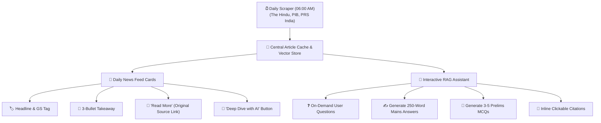

# 📰 Unified Current Affairs & Daily News Architecture Proposal

This document outlines the architectural comparison between the **Daily News Feed** and **Current Affairs RAG Pipeline**, and proposes a **Unified Current Affairs Engine** that combines automated daily news scraping, live source verification, and interactive AI deep-dives.

---

## 1. 🔍 Comparison: Current State

| Feature | 📰 Daily News Feed (`ram_chatbot-main`) | 🔍 Current Affairs Mode (`RAG-main`) |
|---|---|---|
| **Core Nature** | **Passive News Digest** (Curated daily reading feed) | **Active Research Engine** (On-demand question answering) |
| **Trigger Mechanism** | Automated cron job (06:00 AM daily) | User submits a question |
| **Data Scope** | Top ~10–16 pre-selected articles from *The Hindu* & *PIB* | Live web search across 15+ verified Indian portals |
| **Output Format** | Structured 3-bullet points with GS category tag | In-depth analytical examination answer with source citations |
| **Storage & Cache** | Stored in MongoDB / `daily_news.json` (5-day rolling window) | Cached in SQLite `article_cache.db` (6-hour TTL) |
| **Student Usage** | Browsing the morning news summary | Asking specific analytical questions for Mains / Prelims |

---

## 2. 🚀 The Unified Architecture Vision

Instead of maintaining two separate, disconnected systems, the **Unified Current Affairs Hub** merges daily news browsing with interactive RAG capabilities into a single seamless experience.

---

## 3. 💡 Key Components of the Unified System

### A. Dynamic News Cards with "Read More" Links
Every morning, the system scrapes and formats news articles. Each card on the user dashboard contains:
1. **Headline & Paper Category:** (e.g., `GS-3: Science & Technology`)
2. **Key Takeaways:** 3 concise bullet points explaining the core event.
3. **Exam Relevance Box:** Why this news matters for Prelims / Mains.
4. **🔗 "Read Full Article" Button:** A direct external link leading to the original source (`pib.gov.in`, `thehindu.com`, etc.) for student verification.

### B. One-Click "Ask AI About This News" Integration
Right on the news card, students can click an **"Analyze with AI"** action button, which opens the chatbot with that specific article pre-loaded into context. Students can immediately trigger actions such as:
- **"Generate a 250-word Mains Answer":** Creates an introduction, body (pros/cons/challenges), and forward-looking conclusion with GS paper alignment.
- **"Create 3 Practice MCQs":** Instantly creates multiple-choice questions with statement-based questions matching the latest UPSC Prelims pattern.
- **"Explain Policy Impact":** Breaks down complex legislative acts or government schemes into simple points.

### C. Unified Smart Caching (Zero Redundancy)
- Articles fetched during the morning scraper are automatically placed in the **shared Article Cache and Vector Store**.
- When a student asks a question about today's breaking news in the chatbot, the system **skips live web searching** and answers instantly from the pre-warmed cache (0ms search latency).

---

## 4. 🌟 Why This Model is Best for UPSC Aspirants

1. **100% Primary Source Trust:**
   Aspirants demand authenticity. Providing direct **"Read More"** links to official government gazettes, PIB releases, and reputable editorial pages eliminates skepticism.
2. **From Passive Reading to Active Mastery:**
   Students don't just read news passively; they test their understanding immediately via AI-generated MCQs and answer-writing practice.
3. **Time Efficiency:**
   Reduces newspaper reading and note-making time from **2 hours to 20 minutes** per day.
